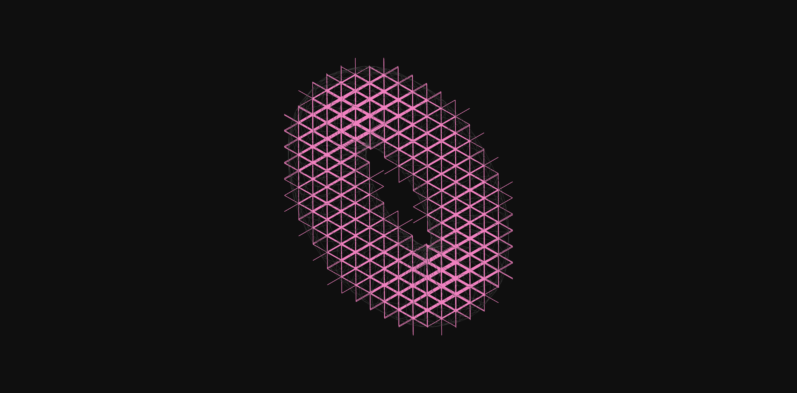
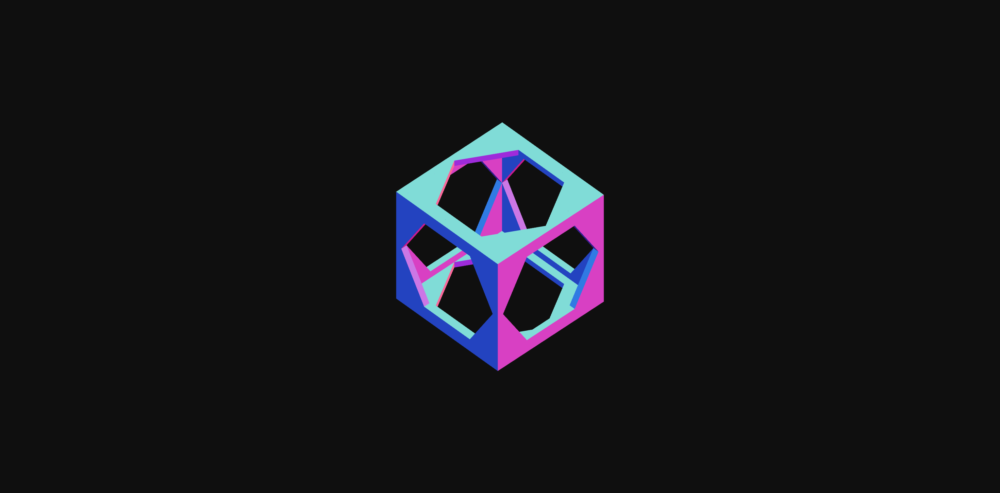
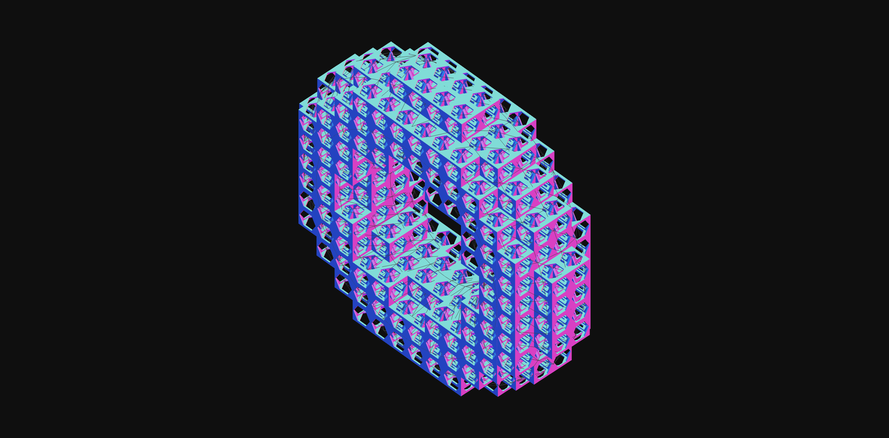

# 3D Lattice with R3F

This is an experiement to see if you can create a volume lattice by voxelizing a mesh and using lattice cells with overlapping vertices.

## Screenshots

### Example of a single lattice cell

### Example of a voxelized mesh that uses the lattice cells

---

### Example of RoundedBox as cell

### Example of RoundedBox as Star cell

## Example of Hexagon as cell

## Example of better hexagon cell

